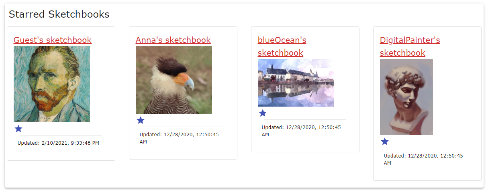
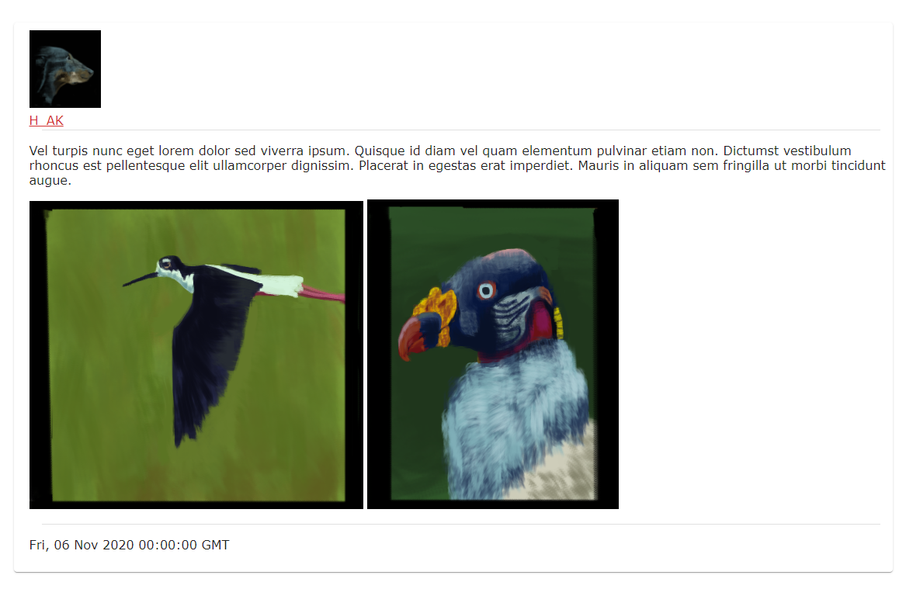
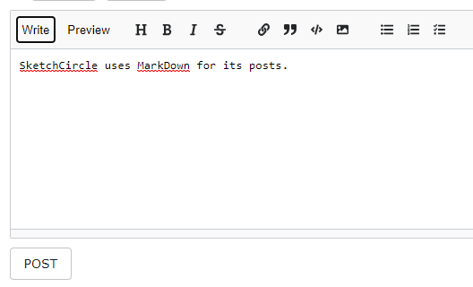
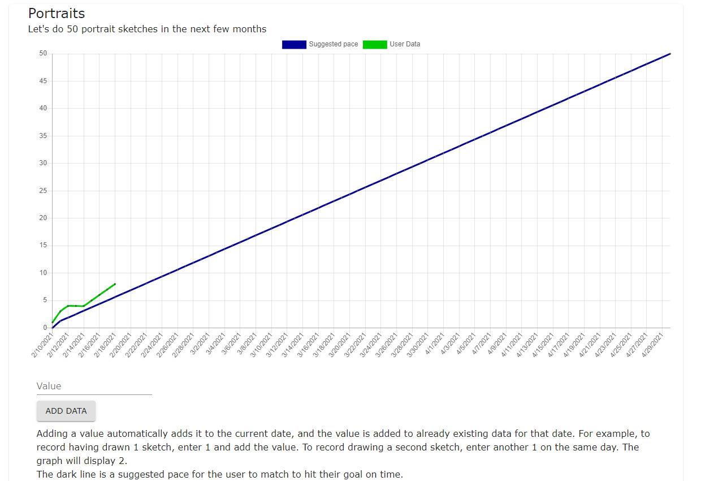
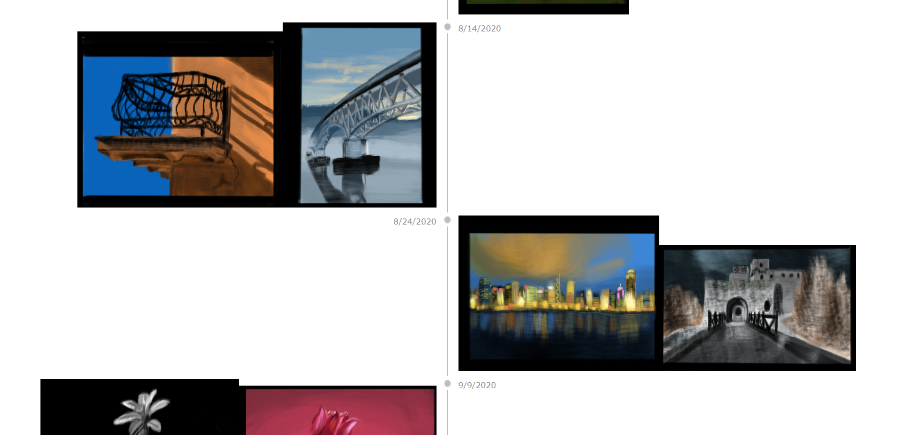

# Sketchcircle
  *By Sean McLaughlan - [Visit SketchCircle](http://sketchcircle.herokuapp.com)*

- [Sketchcircle](#sketchcircle)
  - [SketchCircle at a Glance](#sketchcircle-at-a-glance)
    - [Starring (favoriting)](#starring-favoriting)
    - [Posting](#posting)
    - [Goals](#goals)
    - [Image Only Timeline](#image-only-timeline)
  - [Front-end](#front-end)
    - [React](#react)
    - [Redux](#redux)
    - [MaterialUI](#materialui)
  - [Back-end](#back-end)
    - [PostgreSQL](#postgresql)
    - [Flask](#flask)
  - [Conclusion](#conclusion)

## SketchCircle at a Glance
Sketchcircle is designed to support the features specific to art improvement sketchbook communities, which typically have been based on forums. In addition to posting to and starring (favoriting) sketchbooks, users can set goals and view an image only timeline for each sketchbook.

### Starring (favoriting)
Starring sketchbooks puts them into a separate area at the top of the page, making personally important content easy to find.



### Posting
Posts on SketchCircle are handled through Markdown and the [reacte-mde](https://www.npmjs.com/package/react-mde) package.

An example post:



The Markdown editor:



### Goals
Goals have a name, description, target value, and target date, as well as data points recording values and dates. These goals are publicly viewable on the site. If a goal is reached or failed a message will be displayed saying whether the goal was accomplished or not. Adding new data will automatically be added to the current date on the graph.



### Image Only Timeline
The image only timeline feature allows users to see all the images from that particular sketchbook without text or responses from other users.



## Front-end
The front-end of SketchCircle uses JavaScript, React, Redux, and MaterialUI.

### React
SketchCircle uses React to create a smooth user experience. Navigating the site is much quicker than if vanilla JavaScript had been used, for example.

### Redux
Redux is used to store the site's data on the front-end. While Redux was not strictly necessary for SketchCircle, I chose to use it so that I could learn more about it and spend more time using it.

One advantage of using Redux, though, is that returning to previous sketchbooks or the main page will be instant, not requiring waiting for new data.

### MaterialUI

```js
import { Button, Container, Paper, Grid, Typography } from '@material-ui/core';
```
MaterialUI offers a library of React components that were used to save time and create a uniform look and feel for the project.

## Back-end
The back-end uses Python, Flask, and PostgreSQL.

### PostgreSQL
The database stores everything from users, to posts, to favorites, goals and goal data points.

### Flask
Flask is also used on the back-end for saving to and querying the database.

## Conclusion
My two main goals with this project were learning more about Redux and also making a project with a few real users in mind. I got to spend more time with Redux on this project than any in the past. I also discussed the features that potential users would want from something like SketchCircle, which is where the goal setting and image only timeline originated.
